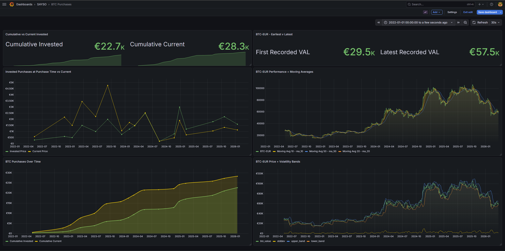

# If you S.A.Y. S.O. T.V.

If you S.A.Y. S.O. T.V. -> if you Stock As You've Seen on TV. A personal BTC portfolio tracker that fetches historical and current Bitcoin prices, computes the current value of past purchases, and stores results in a PostgreSQL database visualised with Grafana.



## Overview

You define your purchase history in a JSON file. On each run the Python job:
1. Fetches historical BTC/EUR close prices via `yfinance` for each purchase date up to today
2. Computes the current value of each holding based on today's price
3. Upserts results into Postgres
4. Stores the full BTC/EUR price history for charting in Grafana

## Stack

| Service | Purpose |
|---|---|
| Python | Fetches prices, computes values, writes to DB |
| PostgreSQL | Stores purchases and BTC price history |
| Grafana | Visualises portfolio growth over time |
| Docker Compose | Orchestrates all services |

## Project Structure

```
GetBTCPrices/
├── docker-compose.yml
├── data/
│   └── purchase_data.json       # Your purchase history (not committed)
│   └── purchase_data_sample.json
├── grafana/
│   ├── dashboards/              # Pre-made grafana dashboard sample
│   └── provisioning/            # Datasource + dashboard provider config
├── postgres/
│   └── init.sql                 # DB schema
└── python/
    ├── get_btc_prices.py
    ├── reqs.txt
    └── Dockerfile
```

## Getting Started

### 1. Add your purchase data

Copy the sample file and fill in your real purchases:

```sh
cp data/purchase_data_sample.json data/purchase_data.json
```

Format:

```json
{
    "purchases": [
        {
            "date": "YYYY-MM-DD",
            "purchase_value": 500,
            "current_value": 0,
            "btc_quantity": 0.02133640,     // Might remove it later, not really necessary
            "close_price": 0
        }
    ]
}
```

> `current_value` and `close_price` are populated automatically by the script.

### 2. Run

```sh
docker compose up
```

This starts Postgres and Grafana, then runs the Python job once.

### 3. View in Grafana

Open [http://localhost:3000](http://localhost:3000) — the **BTC Purchases** dashboard under the **Sayso** folder loads automatically.
